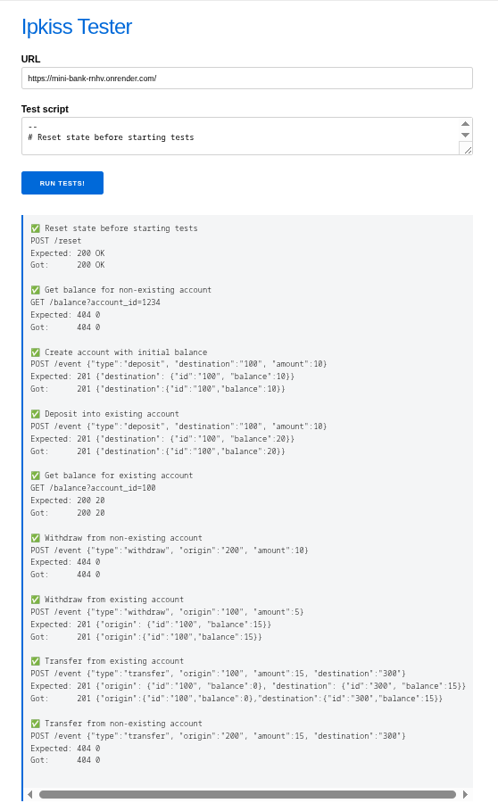

# Simple Banking System API

   

This project is a RESTful API built with Spring Boot for simulating a basic banking system. It handles account management and transactions such as deposits, withdrawals, and transfers. Developed as a solution for the Ebanx coding challenge, it demonstrates CRUD-like operations for financial events, with validation, exception handling, and database persistence using PostgreSQL.

Deployed on Render, this project uses a single container for both the server and its PostgreSQL database. The initial startup time can take up to 50 seconds. The application is live at: https://mini-bank-rnhv.onrender.com/

## Description

The Mini-Bank API provides endpoints for managing bank accounts and processing transactions. Accounts are created automatically when needed (e.g., during deposits), and transactions are recorded with types like deposit, withdraw, or transfer. It includes balance checks, insufficient funds handling, and a reset feature to clear the database for testing.

This application showcases Spring Boot best practices, including entity relationships (one-to-many between accounts and transactions), service layers, and custom exceptions.

## Running Tests

After a waiting period of approximately 50 seconds, you can test the application in the test suite using the following URL: http://ipkiss.pragmazero.com/



## Features

- **Account Management**: Automatic creation of accounts, balance retrieval, and updates via transactions.
- **Transaction Processing**: Support for deposits, withdrawals, and transfers with validation for sufficient balance.
- **Reset Functionality**: Clear all accounts and transactions for a fresh start.
- **Validation and Exceptions**: Ensures positive amounts, valid transaction types, and handles not-found accounts or insufficient balances.
- **Database Persistence**: Uses JPA/Hibernate to store accounts and transaction history.
- **Many-to-One Relationships**: Transactions linked to origin and destination accounts.

## Technologies Used

- **Java**: Version 17
- **Spring Boot**: Version 3.5.4 (with starters for Web, Data JPA, Validation)
- **Database**: PostgreSQL (via JDBC driver)
- **ORM**: Hibernate
- **Build Tool**: Maven
- **Other Libraries**: Lombok for reducing boilerplate code

## Prerequisites

- Java 17 or higher
- Maven 3.6+
- PostgreSQL database (version 12+ recommended)
- Git (for cloning the repository)
- Optional: Docker for containerized PostgreSQL (via spring-boot-docker-compose)

## Setup and Installation

1. **Clone the Repository**:

   ```
   git clone https://github.com/Mirian97/mini-bank.git
   cd mini-bank
   ```

2. **Configure the Database**:

   - Create a PostgreSQL database (e.g., `banking_db`).
   - Update `application.properties` with your database URL, username, and password if necessary (defaults to standard PostgreSQL setup).

3. **Build the Project**:
   ```
   mvn clean install
   ```

## Running the Application

1. **Start the Application**:

   ```
   mvn spring-boot:run
   ```

   The application will start on `http://localhost:8080`.

2. **Optional: Use Docker Compose**:
   If configured, Spring Boot will automatically start a PostgreSQL container.

## API Endpoints

### Events (Transactions)

- **POST /event**: Process a transaction (Body: TransactionDTO with type, amount, origin, destination).
  - Types: "deposit", "withdraw", "transfer".
  - Returns: EventResponseDTO with updated origin and/or destination accounts.

### Balance

- **GET /balance?accountId={id}**: Retrieve the balance for a specific account.
  - Returns: Balance as a long integer (or 0 if account not found).

### Reset

- **POST /reset**: Delete all accounts and transactions.
  - Returns: "OK" on success.

**Example Request Body for Transaction (Deposit)**:

```json
{
  "type": "deposit",
  "amount": 1000,
  "destination": 12345
}
```

**Example Request Body for Transaction (Withdraw)**:

```json
{
  "type": "withdraw",
  "amount": 1000,
  "origin": 12345
}
```

**Example Request Body for Transaction (Transfer)**:

```json
{
  "type": "transfer",
  "amount": 500,
  "origin": 12345,
  "destination": 67890
}
```

## Contributing

Contributions are welcome! Fork the repository, make your changes, and submit a pull request. Ensure code follows the project's style and include tests for new features.

## License

This project is licensed under the MIT License. See the [LICENSE](LICENSE) file for details.
